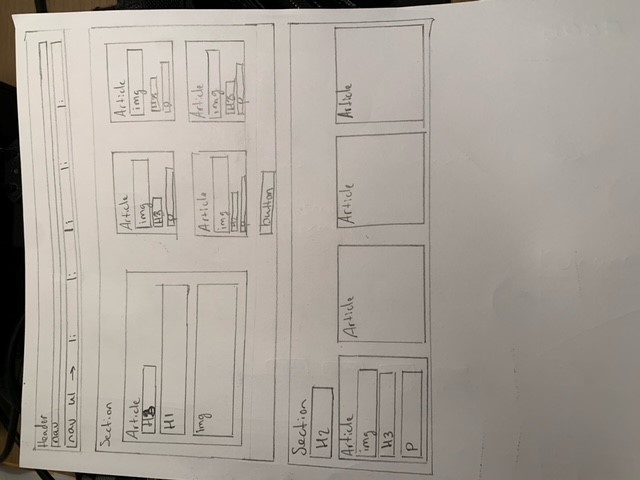
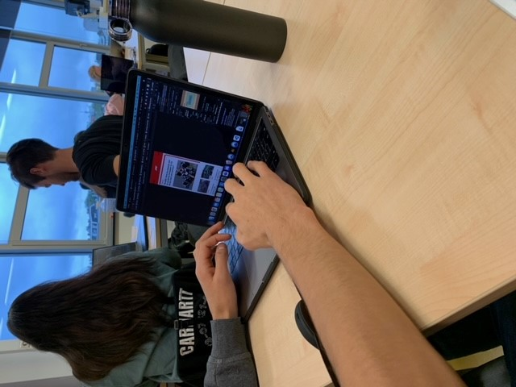
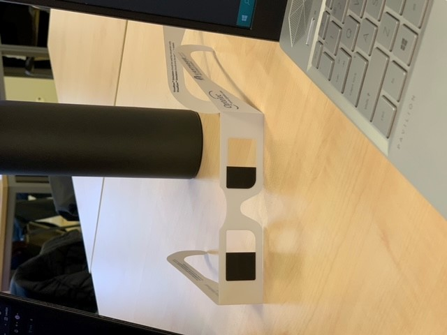

# Procesverslag
Markdown is een simpele manier om HTML te schrijven.  
Markdown cheat cheet: [Hulp bij het schrijven van Markdown](https://github.com/adam-p/markdown-here/wiki/Markdown-Cheatsheet).

Nb. De standaardstructuur en de spartaanse opmaak van de README.md zijn helemaal prima. Het gaat om de inhoud van je procesverslag. Besteedt de tijd voor pracht en praal aan je website.

Nb. Door *open* toe te voegen aan een *details* element kun je deze standaard open zetten. Fijn om dat steeds voor de relevante stuk(ken) te doen.

## Jij

uitwerken voor kick-off werkgroep

### Auteur:
Luc van der Heiden

#### Je startniveau:
Rood

#### Je focus:
Responsive (met een beetje surface plane)
 

## Je website

uitwerken voor kick-off werkgroep

### Je opdracht:
Ik ga de officiële website van de Formule 1 namaken: https://www.formula1.com/en.html.

#### Screenshot(s) van de eerste pagina (small screen): 
hier de naam van de pagina  

#### Screenshot(s) van de tweede pagina (small screen):
hier de naam van de pagina  

 

## Breakdownschets (week 1)

uitwerken na afloop 2e werkgroep

### de hele pagina: 

## Voortgang 1 (week 2)

uitwerken voor 1e voortgang

### Stand van zaken
Ik ben begonnen met de header en navigatie. Deze heb ik alleen even simpel uitgewerkt. Daarna ben ik verder gegaan met de eerste section, de nieuwsartikelen. Dit heb ik in eerste instantie niet heel handig gedaan, ik heb het namelijk met flexbox gemaakt. Dit ging vrij makkelijk en werkte ook goed op het grote scherm, maar het was niet erg handig voor de responsiveness. Na het eerste voortgangsgesprek heb ik dit besproken met de studentassistenten en ben ik dit gaan veranderen naar een grid. Het werkt nu op het grote scherm, maar is nog steeds niet helemaal responsive. Volgende week wil ik proberen dit responsive te maken zodat het er mooi uitziet op groot en klein scherm.

### Verslag van meeting
hier na afloop snel de uitkomsten van de meeting vastleggen

- Werken aan responsiveness --> omzetten in grid.
- Navigatie afmaken

## Voortgang 2 (week 3)

uitwerken voor 2e voortgang

### Stand van zaken
Ik heb deze week gewerkt aan de navigatie en de responsiveness van de eerste sectie. Voor de navigatie heb ik de informatie gebruikt uit de opdrachten en slides over grid. Dit was enorm handig en ik heb hiermee een soortgelijke navigatie menu gemaakt. De verschillende opties zijn te zien op de bovenste balk (de header) wanneer het scherm groot is, maar als het scherm kleiner wordt, richting mobiel formaat, verdwijnen deze opties omdat ze niet meer passen. Er komt dan een hamburgermenu voor in de plaats. Als je hierop klikt komt een menu vanaf de zijkant tevoorschijn. 
 
Bij de nieuwsartikelen wordt nu grid gebruikt in plaats van flexbox. Hierdoor kan ik de layout veranderen wanneer het scherm groter en/of kleiner wordt. Nu is de layout altijd mooi en daarnaast ook hetzelfde als op de echte site.

### Verslag van meeting
hier na afloop snel de uitkomsten van de meeting vastleggen

- Goede voortgang
- Snel verder met de rest van de pagina
- Kijken naar mogelijke simpele hover animaties

## Toegankelijkheidstest (week 4)

uitwerken na test in 8e voortgang

### Bevindingen
- Schokapparaat heeft grote gevolgen
- Met veel oogafwijkingen nog steeds prima te lezen website, ook qua contrast. Alleen de wazige bril maakt het lezen van tekst lastig.

#### Schokapparaat
Door het schokapparaat simuleerden we een motorrieke stoornis. Dit maakt het bedienen van de pagina erg lastig. Het was lastig om op kleine links of buttons te klikken en het was daarnaast ook lastig om precies te zijn met scrollen.

Een mogelijke oplossing hiervoor is het groter maken van links en buttons. Op mijn website is dat gelukkig al redelijk goed geregeld aangezien je bij bijna alle links op vrijwel de gehele content kan klikken. Bijvoorbeeld bij de nieuwsartikelen. De gebruiker kan klikken op de foto, de tekst en zelfs de padding eromheen.

#### Oogafwijkingen 
Met de meeste brillen lukte het ons redelijke prima om de pagina te doorlopen en tekst te lezen. Echter met de bril waardoor je wazig beeld zag was het wel lastig om tekst te lezen. We moesten erg dichtbij het scherm komen om de tekst te kunnen ontcijferen.

Dit kan waarschijnlijk het makkelijkste opgelost worden door ervoor te zorgen dat de tekst nooit te klein wordt, zelfs als het scherm kleiner wordt.

## Voortgang 3 (week 4)

uitwerken voor 3e voortgang

### Stand van zaken
Ik ben deze week erg lang bezig geweest met de tweede sectie. Deze bevat een 'schedule', een overzicht van alle races waar de gebruiker zijwaarts doorheen kan scrollen. Ik wist niet helemaal hoe ik dit moest aanpakken dus het duurde even voordat het er presentabel uit zag. Het is nu echter wel gelukt en ziet er gelukkig ook nog goed uit. Dit deel van de opdracht heeft me wel een stuk meer tijd gekost dan ik had gehoopt en dat betekent dat ik voor volgende week nog veel werk te doen heb.
 
Ik heb deze week ook wat hover animaties toegevoegd en dit geeft de website meteen een hele professionele uitstraling.

### Verslag van meeting
hier na afloop snel de uitkomsten van de meeting vastleggen

- Voortgang ziet er goed uit, maar er moet nog veel gebeuren
- Probeer voor kwaliteit boven kwantiteit te gaan
- Vergeet de footer niet

## Eindgesprek (week 5)

uitwerken voor eindgesprek

### Stand van zaken
Deze week is er veel gebeurd. Ik heb de derde sectie gemaakt, de standings. Hier liep ik tegen wat problemen op met de css-selectors. Ik had soms elementen niet specifiek genoeg aangeroepen in css waardoor ik meer elementen aan het aanpassen was dan ik wilde. Uiteindelijk heb ik dit verholpen door de selectors iets specifieker te maken. Ik heb ook een footer gemaakt en daarnaast deze ook responsive gemaakt.
 
Daarna ben ik begonnen aan de tweede pagina, de drivers overzicht. Deze pagina was best lastig aangezien er een ingewikkelde hoeveelheid elementen in een kleine ruimte werden geplaatst. Het was even zoeken om te kijken hoe ik dit het beste kon indelen en of ik bijvoorbeeld grid, flexbox of simpelweg position het beste kon gebruiken. Uiteindelijk ben ik voor een combinatie van grid en flexbox gegaan. Zo kon ik alles mooi indelen en zorgen voor goede responsiveness. 

Na het maken van alle pagina's en belangrijke elementen ben ik me gaan focussen op zorgen dat de responsiveness ook goed is op de middenmaten, tussen mobiele en largescreen in. Daarna ben ik meer (hover) animaties gaan toevoegen en heb ik de puntjes op de i gezet. Bijvoorbeeld door het correcte lettertype te implementeren en door een paar vervelende issues weg te werken. Ik liep nog lang tegen een raar probleem aan waarbij de navigatie soms half uit het scherm viel. Het duurde mij erg lang om te ontdekken dat dit kwam doordat ik mijn browser per ongeluk 10% had ingezoomd.
 

 
Uiteindelijk ben ik erg tevreden met het resultaat. Ik had vaak de officiële website en m'n eigen website openstaan en soms was ik even verward op welke ik nu zat. Het feit dat m'n eigen versie zo erg op de officiële versie lijkt is erg leuk.

### Screenshot(s)

## Bronnenlijst

continu bijhouden terwijl je werkt

1. https://www.formula1.com/en.html
2. https://cssgridgarden.com/#nl
3. https://codepen.io/
4. https://css-tricks.com/snippets/css/complete-guide-grid/
5. https://www.w3schools.com/css/css_grid.asp
6. https://css-tricks.com/snippets/css/a-guide-to-flexbox/

